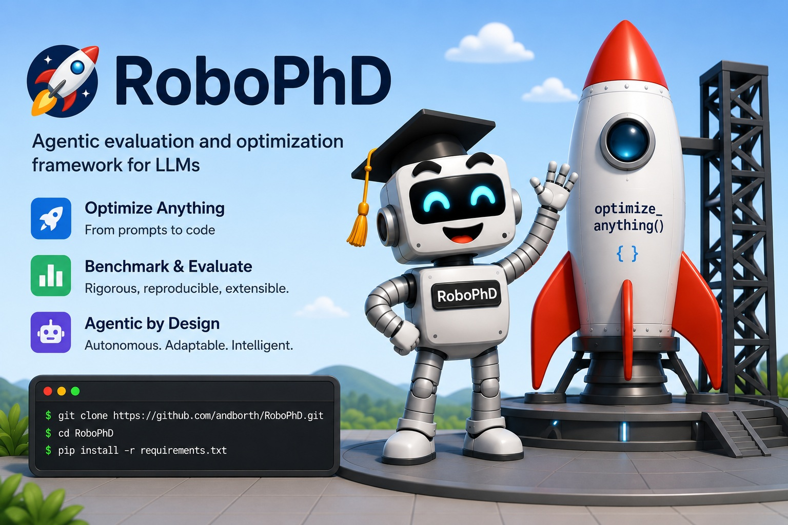

# RoboPhD

**If you can benchmark it, RoboPhD can optimize it.**

[](https://opensource.org/licenses/MIT)
[](https://arxiv.org/abs/2604.04347)

<p align="center">
  
</p>

Give RoboPhD a scoring function and example problems, and it evolves an AI agent that climbs your metric — autonomously, with a training and inference budget you set. You write the evaluator; RoboPhD writes the agent. The interface is one call:

```python
evolved_agent = optimize_anything(evaluator, dataset, seed_agent, objective, background_about_the_task)
```

What comes back is a readable Python agent you own — and it won't look much like what you put in. The seed agent is typically a few dozen lines that demonstrate the API and may score terribly on your metric; the evolved agent can run 1,000+ lines, with a sophisticated prompt and multiple calls to one or more LLMs — and a far higher score (see Key Results below).

> 📄 Paper: [*RoboPhD: Evolving Diverse Complex Agents Under Tight Evaluation Budgets*](https://arxiv.org/abs/2604.04347)

## AstaBench DS-1000 Leaderboard

RoboPhD evolved several agents that earned spots on the [AstaBench DS-1000 leaderboard](https://allenai-asta-bench-leaderboard.hf.space/code-execution), an externally-administered benchmark from the Allen Institute for AI that scores agents on both **accuracy and cost per problem**. RoboPhD now holds the **top three positions** on it.

- The top RoboPhD agent has the **highest accuracy on the entire leaderboard** (86.2%), at **roughly half the cost** of the strongest non-RoboPhD agent (Ai2's ReAct/gemini-3.1-pro-preview at 84.9%, $0.25/problem vs $0.13/problem).
- Two more RoboPhD agents take **second and third** at **85.3%** accuracy for just **$0.04–$0.05 per problem** — beating every non-RoboPhD submission on accuracy at a fraction of the cost.
- A separate RoboPhD agent — using only Claude Sonnet — runs at **just $0.01 per problem** while outscoring five more expensive submissions.

| Accuracy | Cost / problem | Agent |
|---|---|---|
| **86.2%** | **$0.13** | **RoboPhD** (claude-opus-4-7 + 4 others) |
| **85.3%** | **$0.05** | **RoboPhD** (gpt-5.4 + 3 others) |
| **85.3%** | **$0.04** | **RoboPhD** (gpt-5.4 + 2 others) |
| 84.9% | $0.25 | ReAct (gemini-3.1-pro-preview) — *strongest non-RoboPhD agent* |
| 84.7% | $0.05 | ReAct (gpt-5.5) |
| 83.8% | $0.04 | ReAct (gpt-5.4) |
| 83.7% | $0.04 | ReAct (claude-opus-4-6) |
| 83.6% | $0.03 | Button (claude-opus-4-6) |
| **80.9%** | **$0.01** | **RoboPhD** (claude-sonnet-4-6) |
| 78.6% | $0.06 | ReAct (claude-opus-4-7) |
| 78.4% | $0.03 | EvoScientist-Code (GPT-5) |
| 78.0% | $0.02 | ReAct (GPT-5) |
| 75.7% | $0.02 | Smolagents Coder (GPT-5) |
| 75.6% | $0.04 | ReAct (Claude Sonnet 4) |

The Key Results table below complements the leaderboard above with a controlled comparison against two alternative agent-evolution approaches (GEPA and Autoresearch) across six additional benchmarks, run at a fixed evaluation budget of 1,500 problems each.

## Key Results

Tested across six benchmarks with diverse task types — abstract reasoning, cloud scheduling, SQL generation, financial document QA, puzzle-solving speed, and protein function prediction. All runs use a fixed budget of 1,500 evaluations. Scores show test set performance; numbers in parentheses are agent lines of code.

| Benchmark | Seed | RoboPhD | GEPA | Autoresearch |
|-----------|------|---------|------|--------------|
| [ARC-AGI](https://arcprize.org/) (%) | 27.8 (22) | **65.8** (1,013) | 58.5 (366) | 54.2 (304) |
| [Can't Be Late](https://github.com/UCB-ADRS/ADRS/tree/main/openevolve/examples/ADRS/cant-be-late) | -96.5 (31) | -90.7 (148) | -89.3 (142) | **-87.6** (87) |
| [Text2SQL (BIRD)](https://bird-bench.github.io/) (%) | 52.2 (96) | **64.5** (602) | 60.4 (498) | 60.7 (265) |
| [DocFinQA](https://huggingface.co/datasets/kensho/DocFinQA) (%) | 17.7 (29) | **50.4** (825) | 40.0 (207) | 48.2 (198) |
| [Sudoku](https://huggingface.co/datasets/sapientinc/sudoku-extreme) (%) | 0.0 (25) | **90.3** (329) | 83.2 (151) | 87.4 (243) |
| [Protein GO (Price-149)](https://github.com/tttianhao/CLEAN) (%) | 48.4 (53) | **65.9** (682) | 55.7 (317) | 57.7 (200) |

*Can't Be Late scores are negative costs (higher = better). Protein GO scored as canonical CAFA Fmax on the homology-resistant Price-149 split (Yu et al., 2023).*

Using a single default configuration, RoboPhD outperforms both GEPA and Autoresearch on five of six benchmarks, losing only on Can't Be Late — the simplest task, where the winning solution required just 87 lines of code. On the five complex benchmarks, RoboPhD's multi-iteration Elo competition produces substantially larger agents (up to 1,000+ lines) that combine strategies discovered across many evolutionary cycles.

## How It Works

RoboPhD runs a closed-loop evolution cycle: an Evolution agent designs new versions of task agents based on performance feedback, and Elo-based competition selects the best agents across iterations — no human intervention or author-supplied domain knowledge.

RoboPhD uses AI throughout:

1. **Task Execution**: Solver agents execute domain tasks (SQL generation, puzzle solving, scheduling)
2. **Evolution**: Claude Code agents evolve increasingly better task agents
3. **Infrastructure**: The authors used Claude Code to build the RoboPhD system

```
    ┌─────────────────────────────────────────────────────────────┐
    │                      ITERATION CYCLE                        │
    │                                                             │
    │  ┌──────────────────┐         ┌───────────────────-─┐       │
    │  │  EVOLUTION AI    │ Creates │  AGENT ARTIFACTS    │       │
    │  │  (Claude Code    │────────▶│  (per file_mapping) │       │
    │  │   CLI session)   │         └────────┬──────────-─┘       │
    │  └──────────────────┘                  │                    │
    │           ▲                            ▼                    │
    │           │                    ┌───────────────────-─┐      │
    │   Performance                  │  EVALUATOR FN       │      │
    │   data from                    │  Black-box scoring  │      │
    │   prior iterations             │  (candidate,example)│      │
    │           │                    │   → (score, diag)   │      │
    │           │                    └────────┬───────────-┘      │
    │           │                             │                   │
    │           │                             ▼                   │
    │  ┌────────┴─────────┐         ┌────────────────────┐        │
    │  │  AGENT RANKINGS  │◀────────│  Elo COMPETITION   │        │
    │  │  Top agents      │         │  Head-to-head on   │        │
    │  │  inform next     │         │  sampled problems  │        │
    │  │  evolution round │         └────────────────────┘        │
    │  └──────────────────┘                                       │
    │                                                             │
    └─────────────────────────────────────────────────────────────┘
```

### Supported Domains

| Domain | Benchmark | What Evolves | Models Used |
|---|---|---|---|
| ARC-AGI | ARC-AGI (HuggingFace) | `agent.py` — Python solver with `solve()` | Gemini 3.1 Flash Lite |
| Can't Be Late | AWS spot traces (NSDI'24) | `agent.py` — scheduling strategy class | Pure algorithmic (no LLM) |
| Text2SQL | BIRD | `agent.py` + `analyze_db.py` — SQL generation with `llm()` + `test_sql()` | Claude Haiku 4.5 |
| DocFinQA | DocFinQA (ACL 2024) | `agent.py` — retrieval + QA pipeline | GPT-4.1-mini + text-embedding-3-small |
| Sudoku | [sapientinc/sudoku-extreme](https://huggingface.co/datasets/sapientinc/sudoku-extreme) | `agent.py` — Python solver with `solve()` | Pure algorithmic (no LLM) |
| Protein GO | [ProteInfer](https://github.com/google-research/proteinfer) + [Price-149 (CLEAN)](https://github.com/tttianhao/CLEAN) | `agent.py` — GO-MFO prediction with BLAST / ESM / LLM tools | Gemini 3.1 Flash Lite + text-embedding-3-small + ESM-2 |
| AstaBench DS-1000 | [AstaBench DS-1000](https://allenai-asta-bench-leaderboard.hf.space/code-execution) | `agent.py` — Inspect-AI `@solver` with `python_session` Docker sandbox | Varies — evolution picks from 9 handles across 3 providers: Anthropic (Haiku 4.5 / Sonnet 4.6 / Opus 4.8), OpenAI (GPT-5.4-mini / GPT-5.4 / GPT-5.5), Google (Gemini 3.1 Flash Lite / 3.5 Flash / 3.1 Pro Preview) |

Each domain has a self-contained example under [`examples/`](examples/) with evaluator, seed agent, and documentation.

## Quick Start

```bash
# 1. Clone and install
git clone https://github.com/andborth/RoboPhD.git
cd RoboPhD
pip install -r requirements.txt

# 2. Install Claude Code CLI (evolution uses Claude Max auth — no API key needed)
# See: https://docs.anthropic.com/en/docs/claude-code

# 3. Run a smoke test on DocFinQA (the easiest domain to start with)
export OPENAI_API_KEY="sk-..."   # DocFinQA solver: gpt-4.1-mini + text-embedding-3-small
python examples/docfinqa/main.py --num-iterations 2
```

For the other six domains (ARC-AGI, Can't Be Late, Text2SQL, Sudoku, Protein GO, AstaBench DS-1000), see the corresponding `examples/<domain>/README.md` — each documents its own API keys, data downloads, and extra pip installs.

## Optimize Anything API

Use `optimize_anything()` to evolve any text artifact with your own evaluator:

```python
from RoboPhD import optimize_anything, RoboPhDConfig

def evaluator(candidate, example, *, problem_dir=None):
    prompt = candidate["system_prompt"]
    # Call your LLM, run your code, score the result...
    score = 1.0 if correct else 0.0
    return score, {
        "score": score,
        "predicted_answer": predicted,
        # String values are written as files for the evolution AI to read
        "question.md": example["question"],
        "response.md": response_text,
    }

result = optimize_anything(
    evaluator=evaluator,
    dataset=[{"id": "1", "question": "...", "answer": "..."}],
    seed_candidate={"system_prompt": "Your initial prompt here"},
    objective="Maximize accuracy on my task",
    config=RoboPhDConfig(num_iterations=5, evaluation_budget=200),
)
print(result.best_candidate["system_prompt"])
print(f"Best Elo: {result.best_score}")
```

**Resume & extend** — `result.experiment_dir` points to the checkpoint directory, so you can always resume:

```python
# Resume from where it left off
result = optimize_anything(
    evaluator=evaluator, dataset=my_dataset, objective="Maximize accuracy",
    config=RoboPhDConfig(experiment_dir=result.experiment_dir),
)

# Extend by 5 more iterations
result = optimize_anything(
    evaluator=evaluator, dataset=my_dataset, objective="Maximize accuracy",
    config=RoboPhDConfig(experiment_dir=result.experiment_dir, extend_iterations=5),
)
```

Note: `seed_candidate` is only needed for the initial run — on resume, the file mapping is recovered from the checkpoint. `evaluator` and `dataset` are always required (they can't be serialized).

**Evaluating candidates** — use `eval_candidate()` to evaluate any candidate on a dataset:

```python
from RoboPhD import eval_candidate, RoboPhDEvalConfig

eval_result = eval_candidate(
    evaluator=evaluator,
    dataset=test_dataset,
    candidate=result.best_candidate,
    config=RoboPhDEvalConfig(test_repeats=3, max_workers=8),
)
print(f"Accuracy: {eval_result.mean_score:.1%} ({eval_result.num_examples} examples)")
```

See [`RoboPhD/api.py`](RoboPhD/api.py) for the full API reference.

## Configuration

```bash
# Full run with test-set evaluation
python examples/arc_agi_1/main.py --eval-test-set

# Use paper configuration (stronger model, higher cost budget)
python examples/arc_agi_1/main.py --paper-config

# Custom engine config
python examples/arc_agi_1/main.py --engine-config '{"include_evolution_rankings": false}'

# Resume a run
python examples/arc_agi_1/main.py --resume ../robophd_runs/robophd/optimize_anything_20260401_120000

# Extend by 5 more iterations
python examples/arc_agi_1/main.py --resume <dir> --extend 5
```

**Multi-engine support**: All examples support `--engine {robophd,gepa,autoresearch}` to select the optimization engine.

## Requirements

- Python 3.10+
- Claude Code CLI (required for evolution — uses Claude Max auth)
- `pip install -r requirements-gepa.txt` (only if using `--engine gepa`)

Per-example requirements (solver API keys, dataset downloads, extra pip installs) are documented in each `examples/<domain>/README.md`.

## Acknowledgments

RoboPhD builds on several excellent open-source projects and benchmarks:
- [GEPA](https://github.com/gepa-ai/gepa) (Agrawal et al., 2025) — reflective text evolution with Pareto selection
- [Autoresearch](https://github.com/karpathy/autoresearch) (Karpathy, 2026) — single-session greedy experimentation
- [AstaBench](https://openreview.net/forum?id=M7TNf5J26u) (Bragg et al., 2026) — externally-administered, accuracy-and-cost AI agent leaderboard from the Allen Institute for AI; the DS-1000 task is one of its benchmarks
- [ARC Prize](https://arcprize.org/) / [ARC-AGI](https://arxiv.org/abs/1911.01547) (Chollet, 2019) — abstract reasoning benchmark
- [BIRD](https://bird-bench.github.io/) (Li et al., 2024) — Text-to-SQL benchmark
- [DocFinQA](https://huggingface.co/datasets/kensho/DocFinQA) (Reddy et al., 2024) — long-context financial QA benchmark
- [Can't Be Late](https://github.com/UCB-ADRS/ADRS) (Wu et al., 2024) — cloud spot instance scheduling
- [Sudoku via GEPA](https://blog.mariusvach.com/posts/gepa-sudoku-solver) (Vach, 2026) — blog post demonstrating GEPA-evolved Sudoku solvers; inspired the benchmark
- [ProteInfer](https://github.com/google-research/proteinfer) (Sanderson et al., 2023) — deep protein function prediction; source of the clustered-split training corpus and test set
- [CLEAN / Price-149](https://github.com/tttianhao/CLEAN) (Yu et al., 2023) — homology-resistant 149-protein benchmark; used as the headline Protein GO score
- [CAFA-evaluator](https://github.com/BioComputingUP/CAFA-evaluator) (Piovesan et al., 2024) — canonical CAFA Fmax scoring implementation

## Citation

If you use RoboPhD in your research, please cite:

```bibtex
@article{borthwick2026robophd,
  title={RoboPhD: Evolving Diverse Complex Agents Under Tight Evaluation Budgets},
  author={Borthwick, Andrew and Ash, Stephen and Galczak, Anthony},
  journal={arXiv preprint arXiv:2604.04347},
  year={2026}
}
```
